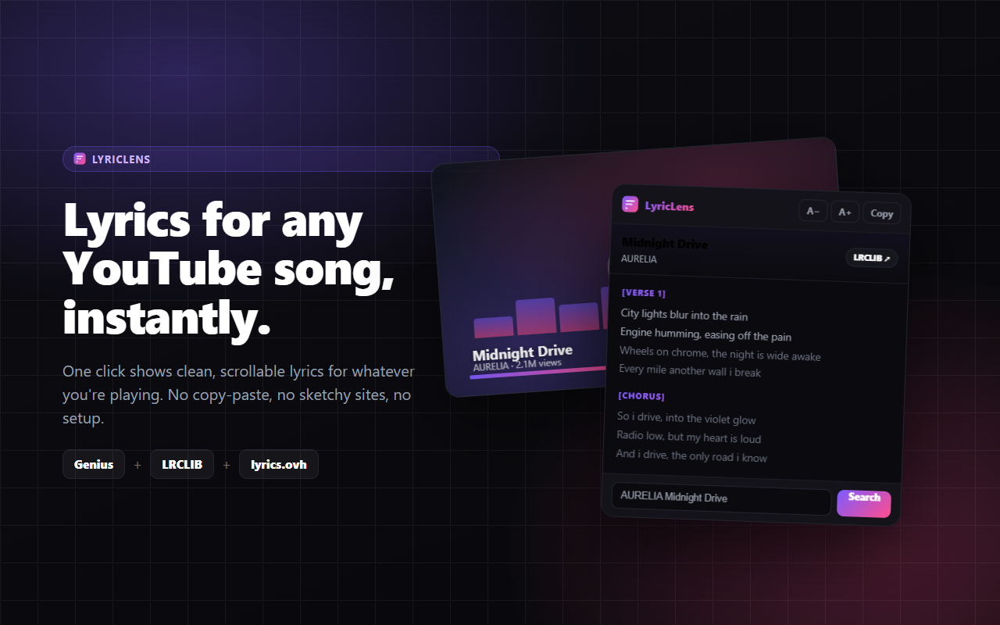

# LyricLens - Lyrics for YouTube

A Chrome extension that shows **synced, scrollable lyrics** for the YouTube song
you're watching, in one click. Pulls from **Genius, then LRCLIB, then lyrics.ovh**
with smart song matching, so you get the *right* lyrics far more often than any
single-source tool.



## Features

- **One-click lyrics** for any `youtube.com/watch` or `music.youtube.com` song.
- **Synced, karaoke-style highlighting** that follows the song in real time and
  auto-scrolls when time-synced lyrics exist (LRCLIB).
- **Smart matching** that cleans the title (`Official Video`, `feat.`, `Remix`...),
  reads the real artist from the channel, and scores by title **and** artist so
  same-named or wrong songs are rejected. Says "not found" instead of guessing.
- **Three sources with auto fallback:** Genius, then LRCLIB, then lyrics.ovh.
- **Reading comfort:** adjustable text size (remembered), one-tap copy, smooth
  scrolling, styled section headers, dark UI.
- **Private:** no account, no tracking, no background activity. Runs only on click.

## Install (unpacked, for development)

1. Open `chrome://extensions`
2. Toggle **Developer mode** (top right)
3. **Load unpacked** and select this folder
4. Pin the extension and open it on a YouTube song

> After editing code, click the reload icon on the extension card.

## Use

- Play a song on YouTube, then click the LyricLens icon.
- It auto-detects the song and shows lyrics; if LRCLIB has synced lyrics, the
  **Sync** badge lights up and lines highlight in time.
- Wrong match? Type `artist song` in the search box and press Enter.
- `A- / A+` resize text. `Copy` copies all lyrics.

## How it works

- `popup.js` reads the active tab's video title and channel via
  `chrome.scripting.executeScript`.
- Searches providers, scores results (`scoreResult`) on title/artist token overlap,
  and renders the best confident match.
- Genius lyrics are parsed from `[data-lyrics-container="true"]`, with non-lyric
  nodes (`data-exclude-from-selection`, images, headers) stripped first. LRCLIB
  returns plain plus LRC synced lyrics; lyrics.ovh returns plain text.
- Synced mode polls the page `<video>.currentTime` every 400 ms to highlight and
  auto-scroll the active line.

No API keys. No server.

## Project layout

```
manifest.json        MV3 manifest
popup.html/.css/.js  the extension UI and logic
icons/               16/32/48/128 PNG icons (generated from the logo)
store/
  assets.html        source template for all marketing graphics
  render.js          renders screenshots, promo tiles, icons, and a QA popup shot
  out/               generated store assets (screenshots, tiles, icon, QA)
  STORE_LISTING.md   copy/paste-ready Chrome Web Store listing
  PRIVACY.md         privacy policy (host this and link it in the listing)
```

## Building store assets

```bash
cd store
npm install            # installs playwright-core (uses your system Chrome)
npm run render         # regenerates everything in store/out/ and icons/
```

`render.js` launches your installed Chrome via `playwright-core`, with no browser
download. Override the path with `CHROME_PATH=... node render.js` if needed.

## Packaging for the Web Store

```bash
npm run pack           # from repo root, builds dist/lyriclens.zip
```

Then upload `dist/lyriclens.zip` in the
[Developer Dashboard](https://chrome.google.com/webstore/devconsole) and fill in
the fields from `store/STORE_LISTING.md`.

## Notes and disclaimers

- Not affiliated with YouTube, Google, or Genius. Lyrics belong to their
  respective owners and are fetched from public providers.
- If a provider changes its markup or API, update the relevant `provide*` function
  in `popup.js`.
```
